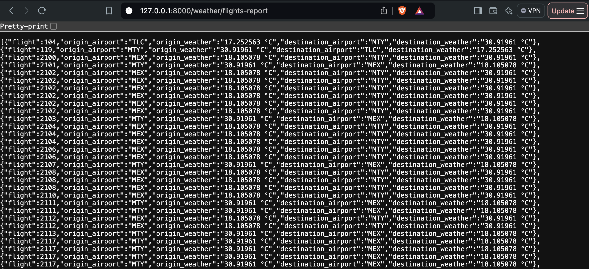

# Weather Forecast Application

This project is a FastAPI-based application that provides weather forecasts for flight routes, including the predicted temperature for the origin and destination cities.

## Features

- Fetches weather data for flights using the Open-Meteo API.
- Returns the predicted temperature for both origin and destination airports.
- Asynchronous calls for efficient data fetching.
- Uses **pandas** for handling weather data.

## Prerequisites

To run the project, ensure you have the following installed:

- Python 3.8+
- `pip` (Python package installer)

## Setup Instructions

### 1. Clone the Repository

```bash
git clone https://github.com/larissaOjeda/WeatherAPI
cd weather_forecast_app
```

### 2. Set Up Virtual Environment
Highly recommended to use it :) 

On macOS/Linux:
```bash
python3 -m venv venv
source venv/bin/activate
```

On Windows:
```bash
python -m venv venv
venv\Scripts\activate
```

### 3. Install Dependencies
To install the dependencies: 

```bash
pip install -r requirements.txt
```

### 4. Add Your Data
Ensure the CSV file containing flight data (challenge_dataset_deal_engine.csv) is present in the data/ folder. This file should contain the following columns:

- origin_latitude
- origin_longitude
- destination_latitude
- destination_longitude
- flight_num
- origin
- destination


### 5. Run the FastAPI Application
Run the FastAPI app using Uvicorn:

```bash
uvicorn app.main:app --reload
```
The application will be available at: http://127.0.0.1:8000

### 6. Access the Weather Forecast API
You can fetch the weather report for flights using the following endpoint:

```bash
GET http://127.0.0.1:8000/weather/flights-report
```
This will return a JSON response with the weather report for each flight in the provided dataset, including the predicted temperature for both the origin and destination airports.

## Example JSON Response
```json
{
  "flights_weather_report": [
    {
      "flight": "AA 123",
      "origin_airport": "JFK",
      "origin_weather": "Predicted temperature: 18.5°C",
      "destination_airport": "LAX",
      "destination_weather": "Predicted temperature: 20.3°C"
    }
  ]
}
```

)

## Project Structure
```bash
weather_forecast_app/
├── app/
│   ├── __init__.py
│   ├── main.py              # FastAPI entry point
│   ├── routers/
│   │   ├── weather.py        # Route definitions for weather
│   ├── services/
│   │   ├── weather_service.py  # Logic for interacting with Open-Meteo API
├── data/
│   ├── challenge_dataset_deal_engine.csv  # CSV file with flight data
├── requirements.txt         # Python dependencies
```

## Troubleshooting
- 404 Not Found: Make sure you're accessing the correct route, which is /weather/flights-report.
- 422 Unprocessable Entity: This could be due to missing or incorrectly formatted data in the flight dataset. Ensure all fields are properly defined and available.
